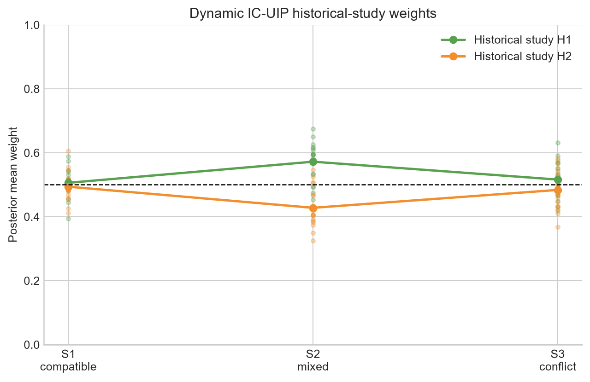

# Small IC-UIP proof-of-concept experiment

## Scope and model

This report is regenerated from `scripts/run_small_simulation.py`; no result is manually entered. Current interval-censored data follow

$$h_i(t)=\lambda_0(t)\exp(\theta Z_i+\beta X_i),$$

with a piecewise-constant baseline hazard whose last interval extends to infinity. Historical studies are converted to Cox summaries $(\hat\theta_k,SE_k,n_k)$; current analyses never receive historical patient-level observations.

For IC-UIP,

$$\mu_w=\sum_k w_k\hat\theta_k,\quad I_w=\sum_k\frac{w_k}{n_kSE_k^2},\quad \theta\mid M,w,\mathcal H\sim N(\mu_w,(MI_w)^{-1}).$$

Weights are no longer fixed: $w\sim Dirichlet(\gamma)$ and their conditional density is

$$p(w\mid-)\propto\prod_k w_k^{\gamma_k-1}I_w^{1/2}\exp\left[-\tfrac12MI_w(\theta-\mu_w)^2\right].$$

The implementation samples additive-log-ratio coordinates one at a time by slice sampling, including the softmax Jacobian. Adaptive $M$ retains the direct truncated-Gamma update

$$M\mid-\sim Gamma\left(3/2,\tfrac12I_w(\theta-\mu_w)^2\right)I(0<M<M_{max}).$$

`IC-CP` is a summary-level commensurate comparator:

$$\hat\theta_k\mid\theta_H\sim N(\theta_H,SE_k^2),\quad \theta\mid\theta_H,\tau\sim N(\theta_H,\tau^{-1}),\quad \tau\sim Gamma(0.5,0.05).$$

It preserves the repository's summary-only constraint. It is not the matched individual-level random-effects model of Fang et al. (2025).

Finite latent failures are sampled by exact inversion within $(L_i,R_i]$. Baseline hazards have Gamma full conditionals. Regression coefficients and UIP weight coordinates use one-dimensional stepping-out slice updates; $M$, $\theta_H$, and $\tau$ have direct standard-distribution updates.

## Experiment settings

- Seed `20260727`; current $n=80$; each historical $n_k=100$.
- True current log-HR `-0.356675`; covariate coefficient `0.3`.
- `20` paired repetitions per scenario.
- `800` iterations, `400` burn-in, thinning `1`.
- Methods: `IC-NIP`, `IC-UIP`, and the literature-motivated `IC-CP` comparator.
- UIP weight prior: $Dirichlet([1.0, 1.0])$; $M_{max}=80.0$.
- Common random numbers are shared across scenarios within each repetition; only historical effects change.

Equivalent ESS remains a diagnostic: posterior borrowing precision is divided by $1/[n\,Var_{IC-NIP}(\theta\mid D)]$.

## Results

| scenario | method | repetitions | bias | rmse | coverage | mean_cri_width | mean_m | mean_equivalent_ess | median_theta_ess | failures | mean_w1 | mean_w2 |
| --- | --- | --- | --- | --- | --- | --- | --- | --- | --- | --- | --- | --- |
| S1_compatible | IC-NIP | 20 | -0.173 | 0.276 | 1.000 | 1.212 | 0.000 | 0.000 | 160.985 | 0 | NA | NA |
| S1_compatible | IC-UIP | 20 | -0.115 | 0.192 | 1.000 | 1.000 | 44.235 | 45.125 | 195.215 | 0 | 0.506 | 0.494 |
| S1_compatible | IC-CP | 20 | -0.120 | 0.191 | 1.000 | 0.952 | NA | 98.452 | 145.880 | 0 | NA | NA |
| S2_mixed | IC-NIP | 20 | -0.173 | 0.276 | 1.000 | 1.212 | 0.000 | 0.000 | 160.985 | 0 | NA | NA |
| S2_mixed | IC-UIP | 20 | -0.045 | 0.174 | 1.000 | 1.007 | 41.676 | 45.536 | 163.806 | 0 | 0.572 | 0.428 |
| S2_mixed | IC-CP | 20 | -0.041 | 0.181 | 1.000 | 1.054 | NA | 82.693 | 139.736 | 0 | NA | NA |
| S3_conflict | IC-NIP | 20 | -0.173 | 0.276 | 1.000 | 1.212 | 0.000 | 0.000 | 160.985 | 0 | NA | NA |
| S3_conflict | IC-UIP | 20 | 0.051 | 0.252 | 1.000 | 1.187 | 17.057 | 22.147 | 125.060 | 0 | 0.516 | 0.484 |
| S3_conflict | IC-CP | 20 | -0.029 | 0.244 | 1.000 | 1.219 | NA | 17.536 | 128.691 | 0 | NA | NA |

## Automated audit

- PASS: no NaN/Inf, boundary, low-ESS, stuck-chain, or fit-failure flags

## Interpretation

In S1, IC-UIP changed RMSE from `0.276` under IC-NIP to `0.192` and mean CrI width from `1.212` to `1.000`. Mean $M$ decreased from `44.235` in S1 to `17.057` in S3, a `61.4%` reduction. In S2, the posterior mean weights were `w1=0.572` and `w2=0.428`, where H1 is the compatible study.

Under S3, IC-UIP had RMSE `0.252` and coverage `1.000`; IC-CP had RMSE `0.244` and coverage `1.000`. These `20`-repetition values are qualitative checks, not publication-level operating characteristics.

## Literature positioning

The closest direct work is Fang et al. (2025), which uses commensurate priors and random effects for matched interval-censored current and historical controls. Murray et al. (2014) provides the right-censored semiparametric commensurate-survival precursor. Gu and Yin (2024) develop a unit-information Dirichlet-process prior for survival distributions, but not this interval-censored regression-effect setting. The reusable search report is in `literature-search-20260727-interval-censored-borrowing/`.

## Limitations and next steps

1. Only PH is implemented; PO/general transformation models require the Gamma-frailty layer.
2. Dynamic weights learn through the treatment-effect UIP kernel; study-level covariate/design discrepancies are not separately modeled.
3. IC-CP is a summary-normal comparator, not a reproduction of Fang et al.'s matched individual-level model.
4. Historical summaries use exact/right-censored Cox fits rather than interval-censored NPMLE/EM fits.
5. Equivalent ESS is posterior-diagnostic rather than prospective IC-design calibration.
6. Short single chains and 20 repetitions are insufficient for final type-I-error or coverage claims.
7. Direct IntCens NPMLE/EM, individual-level Fang-style CP, robust MAP, and normalized power-prior comparisons remain larger follow-up tasks.

See `papers/SOURCES.md` and the literature-search folder for traceable sources and scope cautions.
