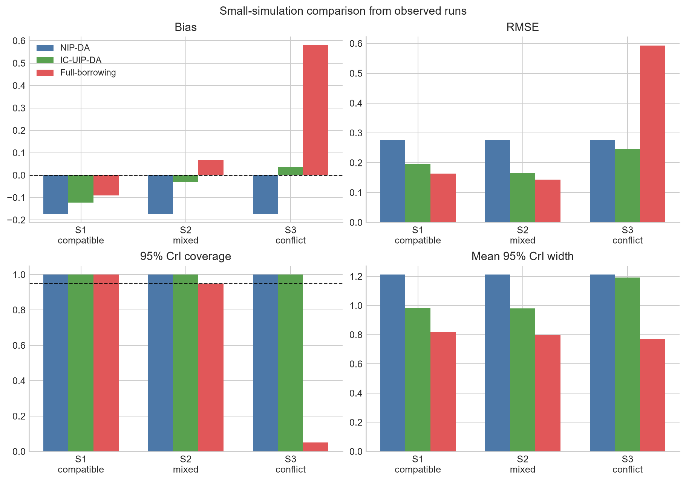
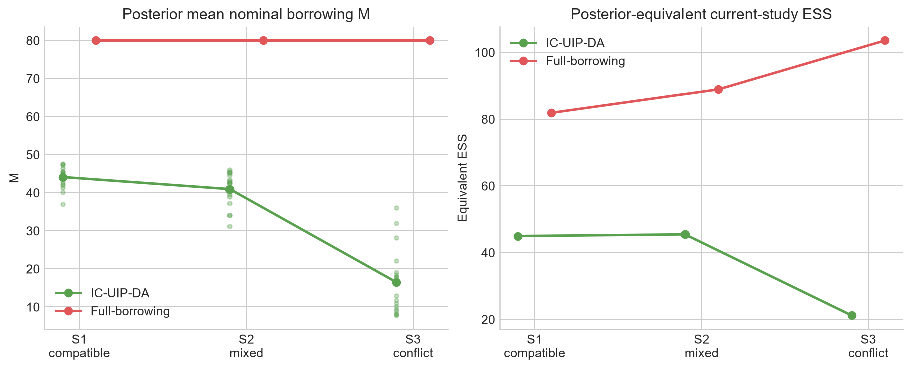

# Small IC-UIP proof-of-concept experiment

## Scope and model

This report records the outputs produced by `scripts/run_small_simulation.py`; no table entry was entered manually. Current data follow a piecewise-exponential proportional-hazards model,

$$h_i(t)=\lambda_0(t)\exp(\theta Z_i+\beta X_i),$$

and are observed only through $(L_i,R_i]$. The last baseline interval extends to infinity. Historical studies are generated as exact/right-censored PH data, converted to Cox summaries $(\hat\theta_k,SE_k,n_k)$, and then discarded by the current analysis.

For fixed equal weights, $\mu_w=\sum_k w_k\hat\theta_k$, $I_w=\sum_k w_k/(n_kSE_k^2)$, and

$$\theta\mid M,\mathcal H\sim N(\mu_w,(MI_w)^{-1}),\qquad M\sim U(0,M_{max}).$$

Finite latent failure times are drawn by inversion inside their observed intervals. Given latent failures, baseline hazards have

$$\lambda_j\mid-\sim Gamma\left(a_0+D_j,\ b_0+\sum_i e^{\theta Z_i+\beta X_i}Y_{ij}\right).$$

The scalar regression updates use a stepping-out slice sampler. This is the only nonstandard-conjugate step. For adaptive UIP,

$$M\mid-\sim Gamma\left(3/2,\tfrac12 I_w(\theta-\mu_w)^2\right)I(0<M<M_{max}).$$

## Fixed experiment settings

- Random seed: `20260727`
- Current sample size: `80`; each historical sample size: `100`
- True current log-HR: `-0.356675`; covariate coefficient: `0.3`
- Repetitions per scenario: `20` successful runs intended from `20` configured runs
- MCMC: `800` iterations, `400` burn-in, thinning `1`
- Methods: NIP-DA, adaptive IC-UIP-DA, and fixed-$M_{max}$ full-borrowing UIP
- Fixed weights: `equal`; $M_{max}=80.0$
- Common random numbers: within each repetition, current data, underlying historical random draws, and method-level MCMC streams are shared across scenarios; only the historical treatment effects change.

The equivalent ESS is a diagnostic, not a design calibration: current per-subject information is approximated by $1/(n\,Var_{NIP}(\theta\mid D))$, and prior precision is divided by this quantity.

## Results

| scenario | method | repetitions | bias | rmse | coverage | mean_cri_width | mean_m | mean_equivalent_ess | median_theta_ess | failures |
| --- | --- | --- | --- | --- | --- | --- | --- | --- | --- | --- |
| S1_compatible | NIP-DA | 20 | -0.173 | 0.276 | 1.000 | 1.212 | 0.000 | 0.000 | 160.985 | 0 |
| S1_compatible | IC-UIP-DA | 20 | -0.123 | 0.195 | 1.000 | 0.984 | 44.130 | 44.992 | 187.901 | 0 |
| S1_compatible | Full-borrowing | 20 | -0.091 | 0.163 | 1.000 | 0.819 | 80.000 | 81.906 | 221.947 | 0 |
| S2_mixed | NIP-DA | 20 | -0.173 | 0.276 | 1.000 | 1.212 | 0.000 | 0.000 | 160.985 | 0 |
| S2_mixed | IC-UIP-DA | 20 | -0.032 | 0.165 | 1.000 | 0.981 | 40.973 | 45.495 | 176.589 | 0 |
| S2_mixed | Full-borrowing | 20 | 0.068 | 0.144 | 0.950 | 0.798 | 80.000 | 88.922 | 221.905 | 0 |
| S3_conflict | NIP-DA | 20 | -0.173 | 0.276 | 1.000 | 1.212 | 0.000 | 0.000 | 160.985 | 0 |
| S3_conflict | IC-UIP-DA | 20 | 0.036 | 0.246 | 1.000 | 1.191 | 16.504 | 21.214 | 110.092 | 0 |
| S3_conflict | Full-borrowing | 20 | 0.580 | 0.593 | 0.050 | 0.768 | 80.000 | 103.571 | 178.090 | 0 |

## Automated audit

- WARN: low empirical coverage (0.050) for Full-borrowing in S3_conflict

## Interpretation

This small experiment is a computational and qualitative check, not a definitive operating-characteristic study. In S1, adaptive IC-UIP-DA reduced RMSE from `{nip_s1['rmse']:.3f}` to `{uip_s1['rmse']:.3f}` and mean interval width from `{nip_s1['mean_cri_width']:.3f}` to `{uip_s1['mean_cri_width']:.3f}`. Its mean $M$ fell from `{uip_s1['mean_m']:.3f}` in S1 to `{uip_s3['mean_m']:.3f}` in S3, a `{m_reduction:.1f}%` reduction. The adaptive method retained S3 empirical coverage `{uip_s3['coverage']:.3f}` in these 20 paired repetitions, while fixed full borrowing had bias `{full_s3['bias']:.3f}` and coverage `{full_s3['coverage']:.3f}`. These results support the intended qualitative behavior: useful precision gain under compatibility and substantial down-weighting under severe conflict.

The shared NIP estimate has bias `{nip_s1['bias']:.3f}` and coverage `{nip_s1['coverage']:.3f}` in only 20 current datasets. This finite-repetition result, and all coverage values in the table, are too coarse for publication-level operating-characteristic claims.

## Current limitations and next steps

1. Only the PH model is implemented; proportional-odds transformation models require the Gamma-frailty layer.
2. Historical weights are fixed and equal; dynamic simplex weights are not sampled.
3. Equivalent ESS is posterior-diagnostic. A prospective interval-censoring-design Fisher-information calibration remains to be implemented.
4. Historical summaries use exact/right-censored Cox fits rather than an interval-censored NPMLE/EM analysis.
5. The sampler uses one chain per generated dataset and short CPU-budget chains. A full study should add multiple chains, rank-normalized $\hat R$, longer runs, and substantially more repetitions.
6. A direct NPMLE/EM benchmark and comparison with power/commensurate priors remain future work.

See `papers/SOURCES.md` for the two user-provided source documents and the exact role each played.
